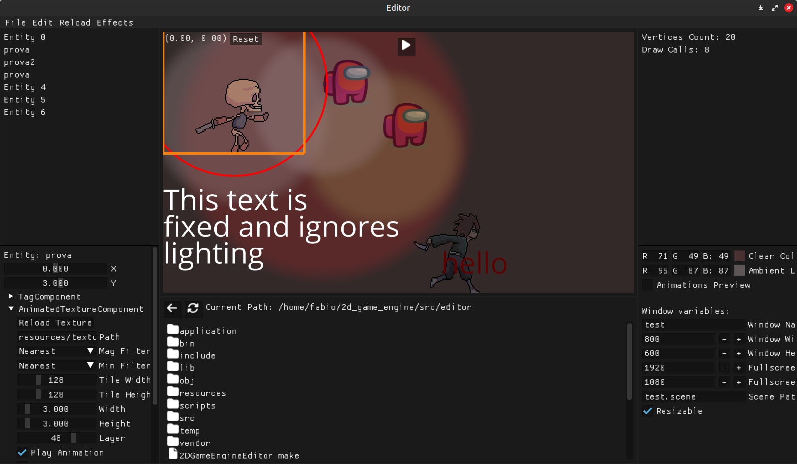

# 2D Game Engine
A 2D game engine made in c++ and opengl.

## Clone
Run `git clone --recursive https://github.com/Fxby16/2D_Game_Engine.git`

## Requirements
Run `sudo bash setup.sh`

## Build
`cd src/editor`  
`premake5 gmake2`  
`make`  
If not specified, the program will be compiled in debug mode. To compile in release mode use `make config=release`.

## Execute
Run `bin/Debug/2DGameEngineEditor` or `bin/Release/2DGameEngineEditor` depending on which config you used.

## Documentation
You can find the documentation [here](https://fxby16.github.io/2D_Game_Engine/).  
**Note:** the documentation might not be updated

## License
This project is licensed under the GNU General Public License v3.0 - see the [LICENSE](LICENSE) file for details.

## Images
